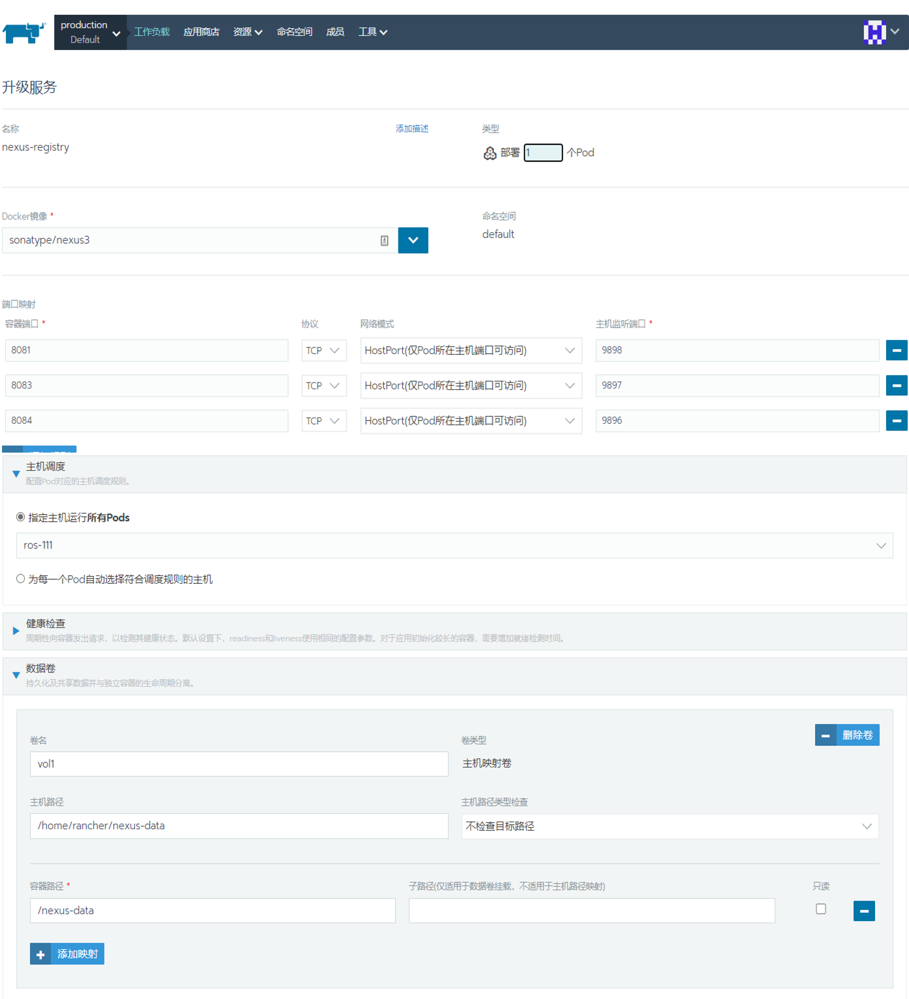
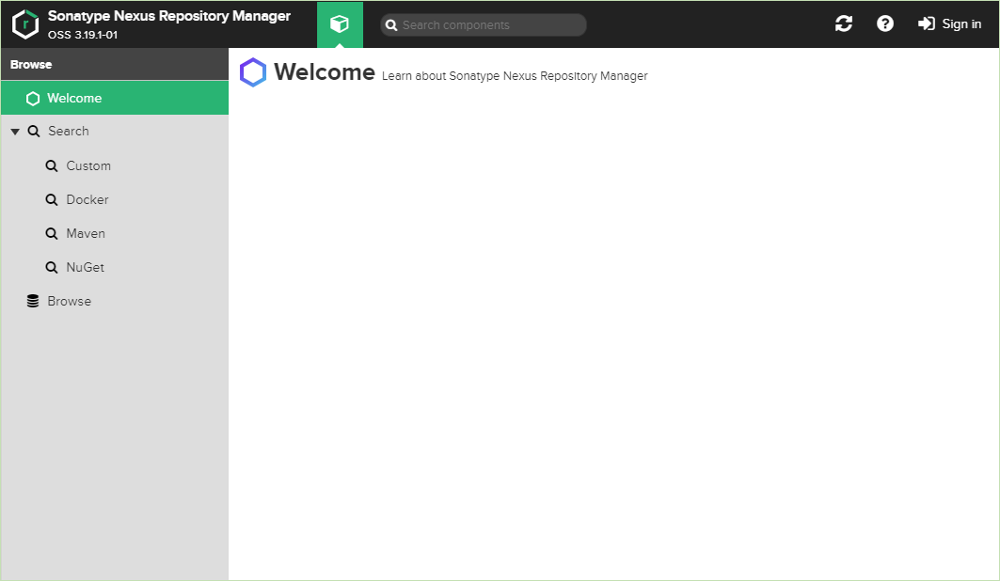
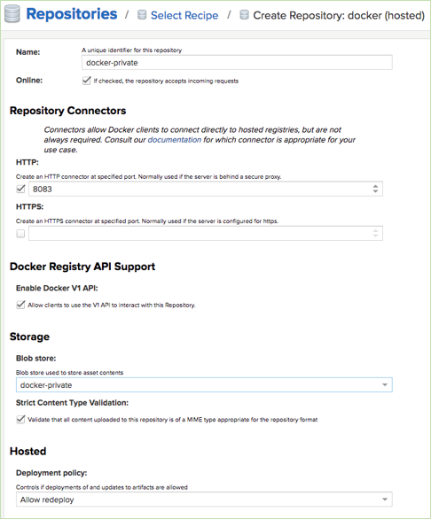
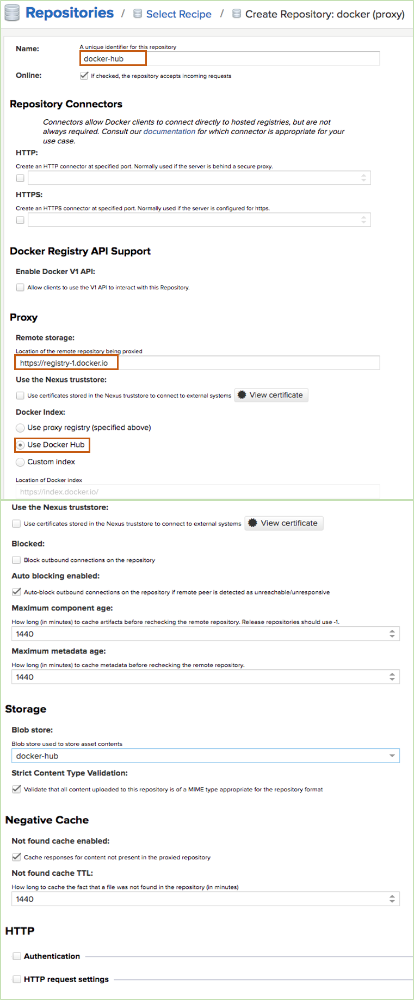
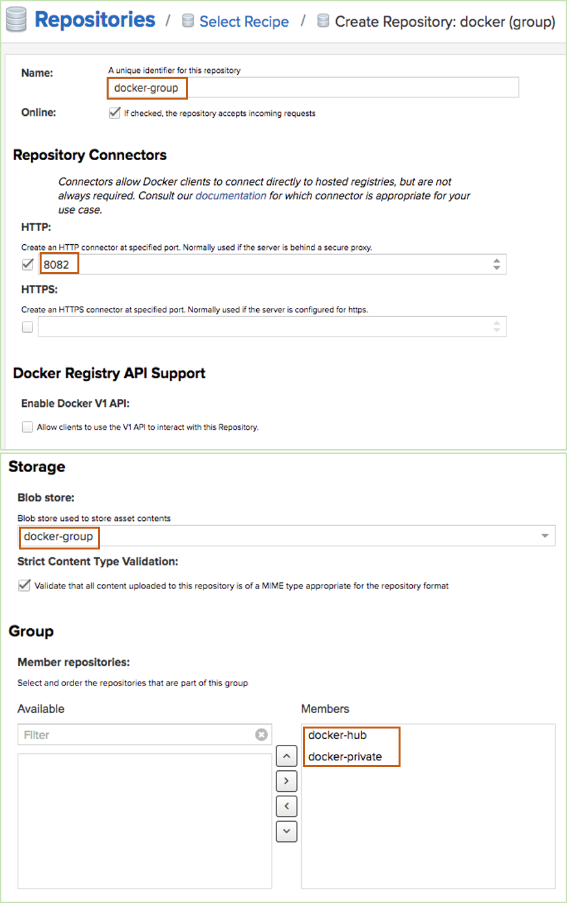
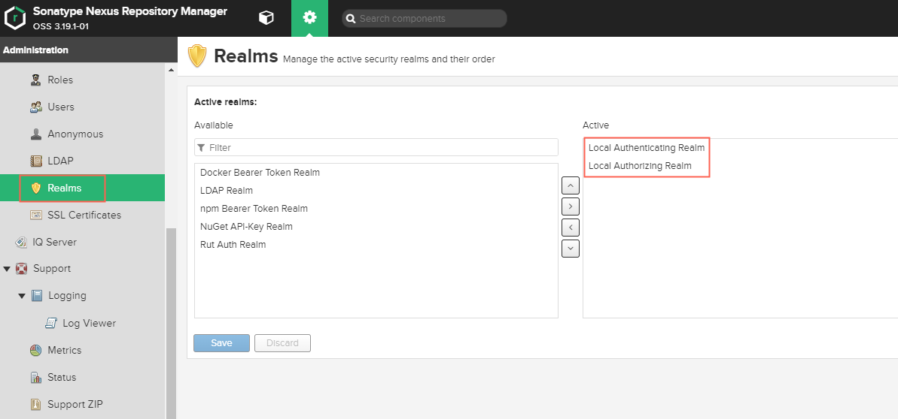
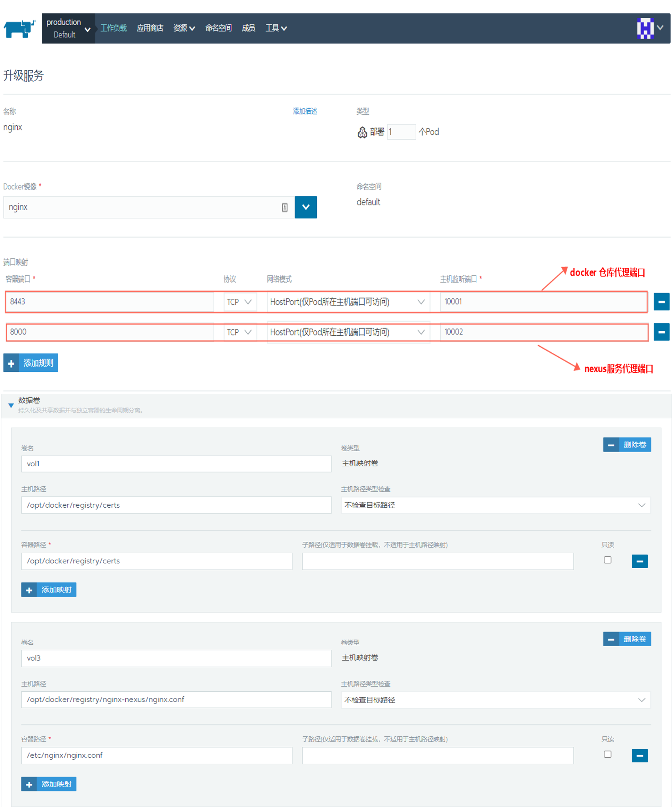

# Docker仓库搭建和使用

- [Docker仓库搭建和使用](#docker仓库搭建和使用)
  - [思路](#思路)
  - [搭建nexus](#搭建nexus)
  - [创建docker仓库](#创建docker仓库)
    - [docker-hosted](#docker-hosted)
    - [docker-proxy](#docker-proxy)
    - [docker-group](#docker-group)
    - [FAQ](#faq)
  - [配置nginx](#配置nginx)
  - [使用](#使用)

使用nexus搭建docker仓库，并为nexus和docker-registry配置nginx代理，其中配置的docker仓库包括：

- **docker-host：** 本地私有仓库，主要用于push镜像
- **docker-proxy：** Docker-Hub共有仓库
- **docker-group：** docker-host和docker-proxy的结合，主要用于从这两个仓库上pull镜像

最后，我们使用`nginx`对`docker-host`和`docker-group`仓库做代理访问。当用户请求为`push`时，访问`docker-host`仓库;当用户请求为`pull`时，访问`docker-group`仓库。

## 思路

1. 搭建nexus服务
2. 配置docker仓库
   1. docker-host
      1. 创建Blob存储
      2. 配置docker-host
   2. docker-proxy
   3. docker-group
      1. 创建Blob仓库
      2. 配置
3. 配置Nginx访问
   1. 在nginx所在服务器上做自签名证书
   2. 编辑配置文件
   3. 搭建nginx

## 搭建nexus

我们使用rancher在现有的k8s环境里搭建，提前创建需要挂载的宿主机目录，并给权限。

```bash
[rancher@node ~] mkdir /home/rancher/nexus-data && chown -R 200 /home/rancher/nexus-data
```



创建完成查看服务



根据提示更改密码(略)

## 创建docker仓库

在nexus上配置docker仓库

### docker-hosted

创建docker-hosted类型私有仓库，并进行相关配置，此仓库主要被用于推送镜像(也可以下载镜像，但是后面创建的docker-group主要用来下载镜像)

**如下**：

- 填写仓库名称；
- 选择http类型，填写仓库端口，（docker-hosted仓库地址为nexus服务所在IP:hosted仓库端口）
- 存储（可提前创建blob存储）



### docker-proxy

创建docker-proxy类型仓库，主要对共有仓库进行配置，配置共有仓库，能够成功获取共有仓库镜像

**如下**：

- 填写仓库名称；
- 填写公共仓库地址
- Docker Index选择官方hub



### docker-group

创建docker-group，把docker-hosted和docker-proxy加入docker-group。使用docker-group从docker-hosted和docker-proxy获取镜像。

**如下**：

- 填写仓库名称；
- 选择http类型，填写group仓库端口，（docker-group仓库地址为nexus服务所在IP:group仓库端口）
- 选择存储
- 把docker-hosted和docker-proxy加入docker-group中
- 其他默认即可



### FAQ



## 配置nginx

为nexus服务以及docker仓库(docker-hosted和docker-group)设置nginx反向代理

其中docker仓库做ssl自签名证书代理

1. 生成证书

    在nginx所在服务器上生成证书，并放入指定位置

    ```bash
    # 设置证书啥的
    openssl req -newkey rsa:4096 -nodes -sha256 -keyout /opt/docker/registry/certs/ domain.key -x509 -days 365 -out /opt/docker/registry/certs/domain.crt

    ## 注意
    编辑openssl.cnf,在[v3_ca]下面添加：subjectAltName = IP:域名|IP地址
    [ v3_ca ]
    subjectAltName = IP:所在服务器IP

    # centos 文件地址：/etc/pki/tls/
    # ubuntu文件地址：/usr/lib/ssl

    # 然后填地区啥的一定要认真，要不然也不会生效，比如：CN BeiJing ip:port啥的
    ```

2. 编写nginx.conf配置文件

    ```vb
    user  root;
    worker_processes  4;

    events {
        worker_connections  1024;
    }

    http{

    upstream nexus_web {
        server 192.168.129.111:9898;
    }

    upstream nexus_docker_get {
        server 192.168.129.111:9896;
    }

    upstream nexus_docker_put {
        server 192.168.129.111:9897;
    }

    # http for nexus
    server {
        listen 8000;

        location / {
            proxy_pass  http://nexus_web;
            # proxy_redirect  off;
            client_max_body_size 1g;
            proxy_connect_timeout 3600;
            proxy_send_timeout 3600;
            proxy_read_timeout 3600;
            proxy_buffering off;
            proxy_request_buffering off;
            proxy_set_header Host $host:10653;
            proxy_set_header X-Real-IP $remote_addr;
            proxy_set_header X-Forwarded-For
            $proxy_add_x_forwarded_for;
        }
    }


    # HTTPS server for docker registry
    server {
        listen       8443 ssl;
    #    server_name  192.168.129.112;
        client_max_body_size 2G;

        ssl_certificate      /opt/docker/registry/certs/domain.crt;
        ssl_certificate_key  /opt/docker/registry/certs/domain.key;

        ssl_session_cache    shared:SSL:10m;
        ssl_session_timeout  60m;
        ssl_ciphers  HIGH:!aNULL:!MD5;
        ssl_prefer_server_ciphers  on;

        chunked_transfer_encoding on;
        # 设置默认使用推送代理
        set $upstream "nexus_docker_put";
        # 当请求是GET，也就是拉取镜像的时候，这里改为拉取代理，如此便解决了拉取和推送的端口统一
        if ( $request_method ~* 'GET') {
            set $upstream "nexus_docker_get";
        }
        # 只有本地仓库才支持搜索，所以将搜索请求转发到本地仓库，否则出现500报错
        if ($request_uri ~ '/search') {
            set $upstream "nexus_docker_put";
        }
        location / {
            proxy_pass http://$upstream;
            proxy_connect_timeout 3600;
            proxy_send_timeout 3600;
            proxy_read_timeout 3600;

            # nexus 支持
            proxy_set_header Host $host:$proxy_port;
            proxy_set_header X-Real-IP $remote_addr;
            proxy_set_header X-Forwarded-For $proxy_add_x_forwarded_for;
            }
        }
    }


    ```

3. 在k8s环境中搭建nginx，使用上述配置文件和证书

    

## 使用

1. 获取docker仓库证书，放在服务器`/etc/docker/certs.d/192.168.129.112:10001`文件夹（需提前创建，并赋予权限）下

    如下:

    ```bash
    [root@node~] ls /etc/docker/certs.d/192.168.129.112:10001
    ca.crt
    ```

2. 使用

    ```bash

    # 登录
    [root@node ~]$ docker login 192.168.129.112:10001 -u xxxx -p xxxxxx

    Authenticating with existing credentials...
    WARNING! Your password will be stored unencrypted in /home/rancher/.docker/config.json.
    Configure a credential helper to remove this warning. See
    https://docs.docker.com/engine/reference/commandline/login/#credentials-store

    Login Succeeded

    # pull镜像，使用docker-group。镜像名字为`仓库地址+镜像名称+镜像版本`，优先从本地私库（docker-hosted）获取镜像
    # 若本地私库不存在则试图从docker-hub上获取

    [root@node ~]$ docker pull 192.168.129.112:10001/nginx

    Using default tag: latest
    latest: Pulling from nginx
    000eee12ec04: Pull complete
    eb22865337de: Pull complete
    bee5d581ef8b: Pull complete
    Digest: sha256:189cce606b29fb2a33ebc2fcecfa8e33b0b99740da4737133cdbcee92f3aba0a
    Status: Downloaded newer image for 192.168.129.112:10001/nginx:latest

    # push推送镜像，先把本地将要push到私有仓库的镜像打标签

    [root@node ~]$ docker image ls

    REPOSITORY   TAG      IMAGE ID        CREATED      SIZE
    nginx       latest     4152a9608752    6 days ago   126MB

    [root@node ~]$ docker tag nginx:latest 192.168.129.112:10001/nginx:latest
    [root@node ~]$ docker push 192.168.129.112:10001/nginx:latest

    ```
